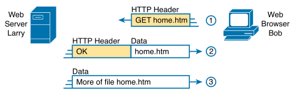
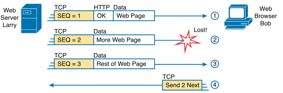
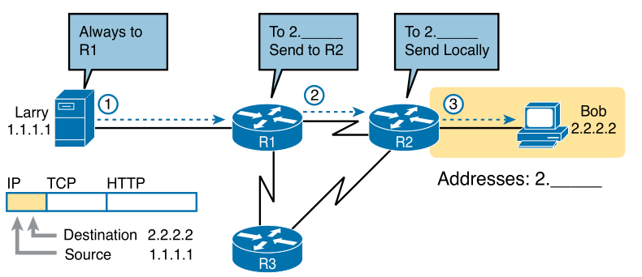

# Chapter 1

### Terms

* **Networking model**: define structure/categories (layers) of standards and protocols - OSI, TCP/IP
* **Same-layer Interaction**: protocol defines a header for two computers to communicate with each other
* **Adjacent-layer interaction**: the layer below provides a service to the layer above on a single computer
* **De-capsulation**: remove headers/trailers around data (go up layers)
* **Encapsulation**: add headers/trailers around data (go down layers)
* **Protocol Data Unit (PDU)**: name for any layer in the OSI model - L#PDU (L#H = header, L#T = trailer)
* **Wireless Local-Area Network (WLAN)**: wireless technology, aka Wi-Fi
* **Enterprise network**: network created by a corporation or enterprise for employees to communicate
* **SOHO (Small Office/Home Office) network**: smaller home network used for business purposes
* **IP host**: any device that has an IP address and connects to any TCP/IP network
* **IP routing (or routing)**: routers forwarding IP packets

### TCP/IP Model
* Application (data) - HTTP, POP3, SMTP, DNS - provides an interface between the software and the network
* Transport (segment) - TCP, UDP - ensures Application layer data is received correctly
* Network (packet) - IP, ICMP - deliver data over entire path (source -> destination)
* Data Link (frame) - Ethernet (802.3), 802.11 (Wi-Fi) - send data over one physical link (Ethernet vs Wi-Fi)
* Physical (bits) - cabling and energy - transmit bits over each individual link

     
    
    
OSI compared to 4 & 5 layer TCP/IP

     

Any layer can communicate to another device without having to go all the way up to the Application layer 

**The following sections go more in depth of a web page being sent from Larry to Bob.**

### Application Layer

     
    
    
HTTP GET request, HTTP reply and data only messages

     

### Transport Layer
Same layer interaction - using TCP headers when Larry and Bob are communicating

Adjacent layer interaction - TCP is providing error checking to HTTP through sequence numbers

     
    
    
TCP providing error recovery for HTTP

     

### Network Layer

     
    
    
Basic Routing Example

     

### Data-Link Layer

     
    
    
Using Ethernet to forward IP packets

     

NOTE: Ethernet is depicted as lines here to show that there are other devices connected but aren't important

Data-link layer is for sending the packet to the next host/router (used for each hop).

Data link protocols control the correct delivery of data over a physical link of a certain type.

### Data Encapsulation

     
    
    
TCP/IP Layers showing encapsulation

     

Note: The application layer sometimes has a header for the data, e.g. HTTP header