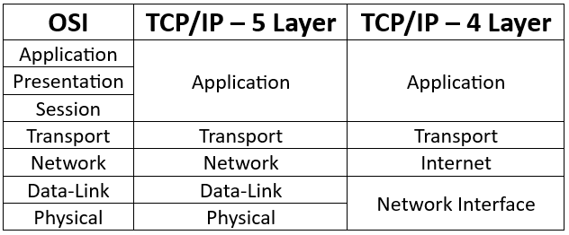
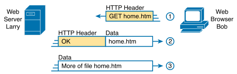
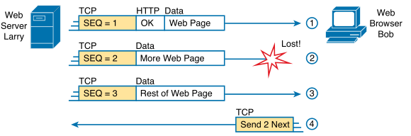
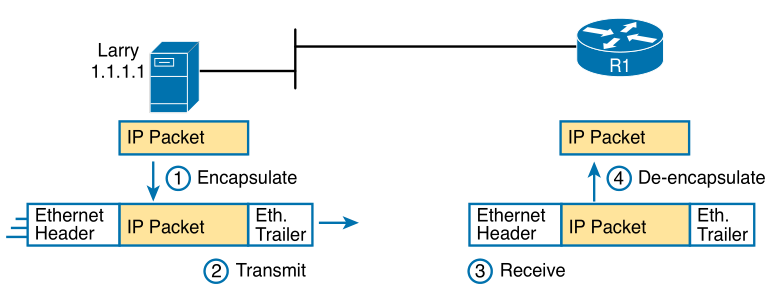
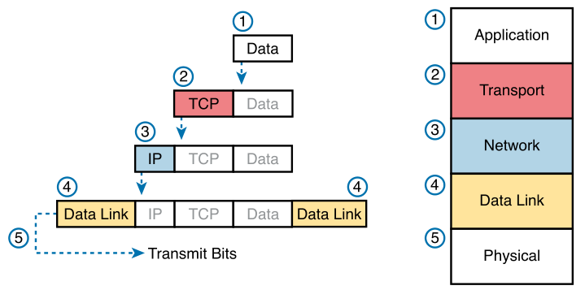

# Chapter 1

### Terms

* **Networking model**: define structure/categories (layers) of standards and protocols - OSI, TCP/IP
* **Same-layer Interaction**: protocol defines a header for two computers to communicate with each other
* **Adjacent-layer interaction**: the layer below provides a service to the layer above on a single computer
* **De-capsulation**: remove headers/trailers around data (go up layers)
* **Encapsulation**: add headers/trailers around data (go down layers)
* **Protocol Data Unit (PDU)**: name for any layer in the OSI model - L#PDU (L#H = header, L#T = trailer)

### TCP/IP Model
* Application (data) - HTTP, POP3, SMTP
* Transport (segment) - TCP, UDP
* Network (packet) - IP, ICMP
* Data Link (frame) - Ethernet (802.3), 802.11 (Wi-Fi)
* Physical (bits) - Electricity? lol

     
    
    
OSI compared to TCP/IP and term of each layer

     

### Application Layer

     
    
    
HTTP GET request, HTTP reply and data only messages

     

### Transport Layer
Same layer interaction - using TCP headers when Larry and Bob are communicating

Adjacent layer interaction - TCP is providing error checking to HTTP through sequence numbers

     
    
    
TCP providing error recovery for HTTP

     

### Network Layer

     
    
    
Basic Routing Example

     

### Data-Link Layer

     
    
    
Using Ethernet to forward IP packets

     

NOTE: Ethernet is depicted as lines here to show that there are other devices connected but aren't important

### Data Encapsulation

     
    
    
TCP/IP Layers showing encapsulation

     

