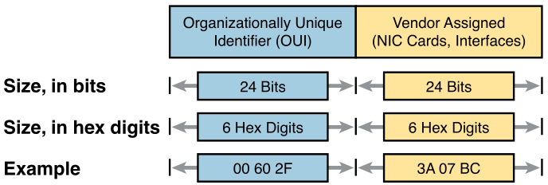

# Chapter 2

### Terms

* **Ethernet link**: a cable (UTP or fibre) connected to two devices using ethernet
* **RJ-45**: the standard of a UTP connector, uses pins 1, 2, 3, 6
* **Ethernet port**: where a UTP cable plugs in
* **NIC (Network Interface Card)**: what PCs use to send and receive on a LAN
* **Fibre-optic cable**: a glass cable where a LED/laser travels through it
* **Core**: where the LED/laser are contained in a fibre optic cable
* **Cladding**: the layer where the LED (MM) bounces off in a fibre optic cable

### SOHO (Small Office/Small Home) and Enterprise LANs

     
    
    
Small wired and wireless SOHO LAN

     

     
    
    
Single-building enterprise wired and wireless LAN

     

### Ethernet Physical Layer Standards

| Speed | Common Name | Informal IEEE Standard Name | Formal IEEE Standard Name | Cable Type, Maximum Length |
| --- | --- | --- | --- | --- |
| 10 Mbps | Ethernet | 10BASE-T | 802.3 | Copper, 100m |
| 100 Mbps | Fast Ethernet | 100BASE-T | 802.3u | Copper, 100m |
| 1000 Mbps | Gigabit Ethernet | 1000BASE-LX | 802.3z | Fibre, 5000m |
| 1000 Mbps | Gigabit Ethernet | 1000BASE-T | 802.3ab | Copper, 100m |
| 10 Gbps | 10 Gig Ethernet | 10GBASE-T | 802.3an | Copper, 100m |

**Ethernet frames** use the same format for the header and trailer no matter the speed or type of cable (UTP/fibre optic) (Ethernet is a standard, not a protocol).

UTP cables are twisted to prevent EMI (crosstalk - EMI from a wire to another wire in the same cable).

SFP (Small Form-factor Pluggable): on switch ports where you decide what interface you want (aka transceiver port) - SFP is like USB-C and the SFP modules are the adapters/dongles.

### Straight-Through and Crossover Cables

     
    
    
10BASE-T/100BASE-T Straight-Through Cable Pinout - 1 & 2 Transmit, 3 & 6 Receive

     

     
    
    
Crossover Ethernet Cable - 10BASE-T & 100BASE-T

     

| Transmits on Pins 1 & 2 | Transmits on Pins 3 & 6 |
| --- | --- |
| PC NICs | Hubs |
| Routers | Switches |
| Wireless access point | - |

1000BASE-T uses 1,2 & 3,6 and 4,5 & 7,8 - with a crossover cable 1,2 and 3,6 are swapped, 4,5 and 7,8 are swapped.

Cisco switches have *auto-mdix* which if the wrong cable is used, it changes it's logic to make the link work.

### Single/Multi Mode Fibre

     
    
    
Transmission on Singlemode Fibre with Laser Transmitter

     

     
    
    
Transmission on Multimode Fibre with Internal Reflection

     

### IEEE 802.3 10-Gbps Fibre Standards - For SFP+ modules

| Standard | Cable Type | Max Distance |
| --- | --- | --- |
| 10GBASE-S | MM | 400m |
| 10GBASE-LX4 | MM | 300m |
| 10GBASE-LR | SM | 10km |
| 10GBASE-E | SM | 30km |

### UTP vs MM vs SM

| Criteria | UTP | Mutlimode | Single-Mode |
| --- | --- | --- | --- |
| Relative cost of cabling | Low | Medium | Medium |
| Relative cost of a switch port | Low | Medium | High |
| Approximate max distance | 100m | 500m | 40km |
| Relative susceptibility to interference | Some | None | None |
| Relative risk of copying from cable emissions | Some | None | None |

### Ethernet Header and Trailer

| Field | Bytes | Description |
| --- | --- | --- |
| Preamble | 7 | Synchronisation - 10101010 10101010..., etc |
| Start Frame Delimiter (SFD) | 1 | Signifies next byte is the dest MAC - 10101011 |
| Destination MAC Address | 6 | MAC address of the device receiving this frame |
| Source MAC Address | 6 | MAC address of the device sending this frame |
| Type | 2 | Type of protocol inside frame (EtherType) - IPv4, IPv6, ICMP, etc |
| Data and Pad | 46 - 1500 (MTU) | L3PDU data, usually an IPv4/IPv6 packet, padding added if needed |
| Frame Check Sequence (FCS) | 4 | Result of error checking the sender performed on this frame (CRC) |

### MAC Addresses

LAN address, Ethernet address, hardware address, burned-in address, physical address, universal address, MAC address are all the same things.

     
    
    
Structure of unicast MAC address

     

**Unicast address**: one MAC address represents one interface on the Ethernet LAN.

**Broadcast address**: has a value of FFFF.FFFF.FFFF, frames sent to this address should be sent to every device on LAN.

**Multicast address**: specifies a certain subset of devices on the Ethernet LAN.

### Half and Full Duplex

**Half duplex**: means that a device must wait to send while receiving a frame.

**Full duplex**: means that a device can send and receive at the same time.

Hubs do not use half-duplex logic, devices must do this, hubs just repeat any incoming signals to all other ports.

     
    
    
Full and half duplex on an Ethernet LAN

     

**Ethernet shared media**: refers to network designs that use hubs, they require CSMA/CD and the bandwidth is shared.

**Ethernet point-to-point**: refers to network designs that use switches, each link works independently.

### Carrier-Sense Multiple Access with Collision Detection

**CSMA/CD**: used with hubs to detect and action collisions in half duplex mode.
1. Device wanting to send waits until Ethernet is not busy
2. When Ethernet is not busy, device starts sending the frame
3. Device listens while sending to see if any collisions occurred, if a collision occurred then:
    1. Send jamming signal to all devices
    2. Each device waits a random time
    3. Reattempt at step 1