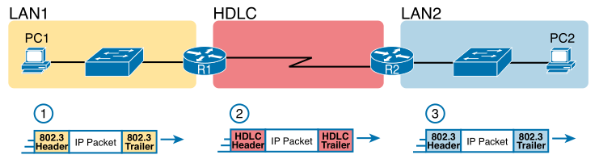
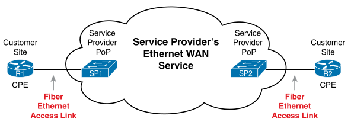
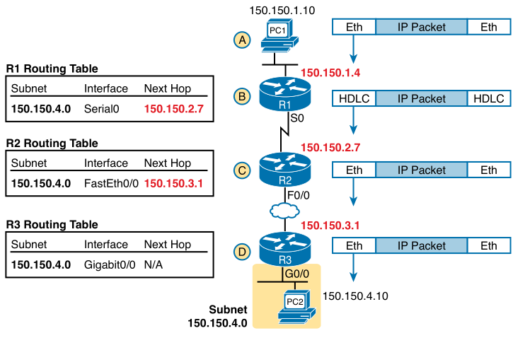
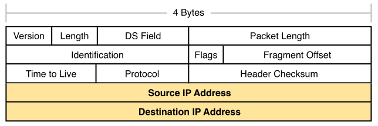
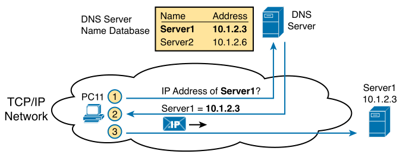
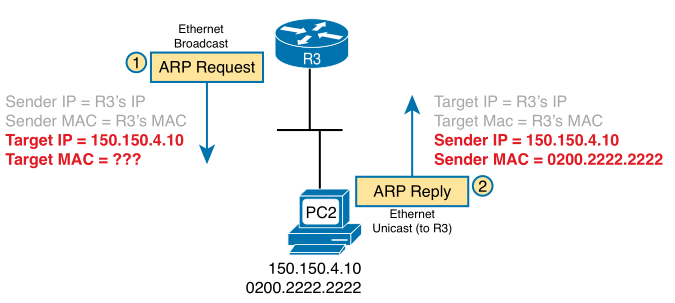

# Chapter 3

### Terms

* **Leased line**: company using line does not own it, they pay a monthly lease fee to use it (level 1 service)
* **Wide-Area Network (WAN)**: communicate over a long distance, router to router
* **Serial interface**: used by routers to connect to serial lines
* **Ethernet over MPLS (Multiprotocol Label Switching)**: technology used to create Ethernet service for customer
* **Ethernet Line Service (E-Line)**: defined by MEF, provides point-to-point Ethernet WAN between two customer devices; like those two devices were connected using an Ethernet crossover cable.
* **Default router (Default Gateway)**: The nearest router on a LAN to a host
* **Default router (Default Gateway)**: IP address of a router that a host sends packets to when it needs them outside of its subnet.
* **Routing protocol**: messages and processes routers use to exchange information to reach different subnets (EIGRP, OSPF, RIP).
* **IPv4 address**: address assigned to hosts, address has a network number, optional subnet number, host number.
* **Hostname**

Data link protocols control the correct delivery of data over a physical link of a certain type.

## Leased-Line WANs
* Routers connect LAN to the WAN and have a WAN link to other routers.
* Leased-line WAN links are full duplex crossover links (eg. pins 1,2 -> 3,6) and installed in most buildings
* They are managed by telcos (telephone company) - large network of cables and specialised switching devices
* Leased-lines are old, slower and take longer to install than Ethernet WAN links, Ethernet WAN links have been replacing them
* Protocols - HDLC & Point-to-Point (PPP)
* **High-level Data Link Control (HDLC)**: proprietary Cisco HDLC (adds type field), like Ethernet, creates WAN link
    * Fields:
        * Flag - pattern to signify new frame incoming
        * Address - destination device
        * Control (not used anymore)
        * Type - type of L3 packet in frame
        * FCS - used for error detection

     
    
    
Routers encapsulating and decapsulating IP packets

     

## Ethernet WANs

Ethernet WAN links use the same data-link protocols as ethernet LANs but add additional features to make them work over longer distances.

     
    
    
Fibre Ethernet link to connect a CPE router to a SP's WAN

    
CPE is Customer Premises Equipment, PoP is point of presence

     

**Ethernet emulation**: link is not a literal Ethernet link from one end to the other

Ethernet WAN links use the same protocols as Ethernet LAN links.

EoMPLS WAN allows routers to send Ethernet frames over link and look like an ethernet link to the customer.

## IP

### Routing

Routers & end-user computers are known as **hosts** in TCP/IP.

Every router has an **IP routing table**, these tables list IP address groupings (IP networks and IP subnets).

**ARP (Address Resolution Protocol)**: dynamically learns the data-link address of an IP host connected to a LAN.

     
    
    
Network layer and Data-link layer encapsulation (the cloud signifies Ethernet WAN link)

     

Routing steps:
1. Check FCS to ensure frame has no errors, discard frame if there are errors.
2. Discard old data-link header and trailer.
3. Compare IP packet's destination IP address to routing table, find route to hop to next.
4. Encapsulate IP packet inside new data-link header and trailer, add destination MAC address of next hop host or router in frame header, then forward the frame.

### Addressing

Any interface that expects to receive IP packets needs an IP address.

**IP subnet (or IP network)**: groups of IP addresses used on the same physical network.

IP addresses not separated by a router are in same subnet, separated by a router then they are in different subnets.

     
    
    
IPv4 Header, 20 bytes in total

     

### Routing Protocols

Routers learn routes for each subnet it connects to and adds it to it's routing table.

How routers learn routes (using routing protocol):
1. Each router adds a route to its IP routing table for each subnet it connects to.
2. Each router tells its neighbours about routes in its IP routing table, including learnt routes from other routers.
3. After learning a new route from a neighbour, it adds route to its IP routing table, typically the next hop on that route is that neighbour.

When a router is connected to a subnet, it adds that subnet into it's IP routing table without using routing protocol.

**Routing update**: a routing protocol message sent to another router to learn about a subnet.

## Other Protocols

### Domain Name System (DNS)

     
    
    
Basic DNS name resolution request

1. PC11 sends DNS query to DNS server.
2. DNS server sends back a DNS reply for Server1's IP address.
3. PC11 is able to send packet to Server1's IP address (10.1.2.3).

### Address Resolution Protocol (ARP)

**ARP Request**: broadcasted to all devices on a LAN, asking "if this is your IP, send your MAC address".

**ARP Reply**: lists both the original IP address and matching MAC address.

     
    
    
Sample ARP Process - PC2 learns R3's IP address and MAC, R3 learns PC2's IP address

Results are added and maintained in hosts/routers ARP caches and ARP tables.

### Ping

**ICMP (Internet Control Message Protocol)**: used for reporting errors and performing network diagnostics.

**Ping (Packet Internet Groper)**: this ensures that the network can send a packet to and from that IP address. It uses ICMP to do an ICMP Echo Request to an IP address, that computer should send back an ICMP Echo Reply.