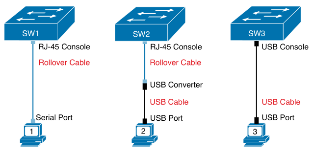
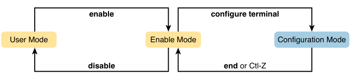
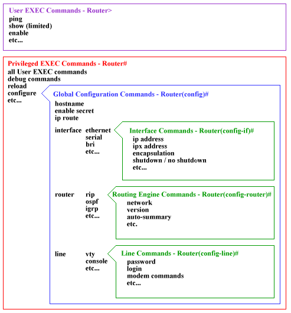

# Chapter 4

## Accessing the Cisco Switch CLI

### Terms
* **command-line interface (CLI)**: interface to interact with the operating system 
* **Telnet**: protocol used to remote into systems with a CLI without encryption
* **Secure Shell**: remote into systems with a CLI with encryption and keys
* **enable mode**: enable settings to switches/routers (user EXEC, password, reload)
* **user mode**: used for nondisruptive EXEC commands, like looking at current status
* **configuration mode**: used for config commands that are added to running config file
* **startup-config file**: sits in NVRAM, holds config file that's loaded into RAM on reload or power on
* **running-config file**: sits in RAM, holds currently ued config

### Cisco Catalyst Switches

This all refers to Cisco Catalyst enterprise-class switches.

RJ-45 UTP 10/100/1000 ports on a Cisco switch can auto-negotiate 10BASE-T, 100BASE-T, 1000BASE-T speeds.

**interfaces** and **ports** are a switch's physical connector.

Interface type are things like Ethernet, Fast Ethernet, Gigabit Ethernet.

Interfaces that run at multiple speeds are referred to as the highest speed, eg. 10/100/1000Mbps interface is called Gigabit Ethernet.

Interfaces are numbered 0/0, 0/1, ... on older switches or 1/0/1, 1/0/2, ... on newer switches.

### Accessing the Cisco IOS CLI

#### Cabling the Console Connection

Switch CLI can be accessed via:
* Console (Physical port) - use serial/USB from PC to RJ-45/USB switch console port, requires driver on pc
* Telnet (IP network) - communicate via IP to switch, unsecure method as it sends all data including username and password in clear-text
* SSH (IP network) - communicate vai IP to switch, secure as it encrypts all messages including passwords

    
    
Console connection to a switch

PC serial port has a D-shell connector with nine pins (DB-9).

Rollover cable is like ethernet but with different pinouts, eg pin 1 -> 8, pin 2 -> 7, pin 3 -> 6, ...

Default console port settings (last 3 settings are **8N1**):
* 9600 bits/second
* No hardware flow control
* **8**-bit ASCII
* **N**o parity bits
* **1** stop bit

#### User and Enable (Privileged) Modes

**user EXEC mode (user mode)** - allows user to type harmless exec commands, '>' at end of command prompt

The `enable` command changes the mode to enable mode and `disable` goes from enable to user mode.

The `reload` command tells the switch reinitialize or reboot, only can be run in enable mode.

Commands that can be used in user mode and enable mode are EXEC commands.

#### Password Security for CLI Access from the Console

* Passwords can be set for when the user connects to the console and when the user moves to enable mode:
    * Enable mode password - `enable secret password123` 
    * user connects to the console password -
        1. `line console 0` - identifies the console, next commands apply to the console only.
        2. `login` - perform simple password checking at login.
        3. `password password123` - the password the user must enter to gain access.

### CLI Help Features

| What You Enter | What Help You Get |
| --- | --- |
| `?` | Lists all commands for mode |
| `command ?` | Lists all first parameters for 'command' |
| `com?` | Lists commands that start with 'com' |
| `command param?` | Lists all first parameters starting with 'param' |
| `command param<TAB>` | Autocomplete the rest of the parameter |
| `command param1 ?` | Lists all second parameters for 'command' |

### The `debug` and `show` Commands

The `show` command lists facts about the switch's operational status. For example: `show mac address-table dynamic` lists the table the switch uses to make forwarding decisions.

The `debug` command remembers all output from commands entered after the command.

## Configuring Cisco IOS Software

Commands entered in configuration mode update the active configuration file, these changes occur immediately.

     
    
    
Escalating/de-escalating different modes in IOS CLI

     

### Configuration Submodes and Contexts

Global configuration mode is the initial configuration mode, you move into subcommand modes (context you care about).

You can move from one configuration submode to another in any configuration submode.

Common switch configuration modes:
| Prompt | Name of mode | Context-setting commands to reach mode |
| --- | --- | --- |
| `hostname(config)#` | Global | None |
| `hostname(config-line)#` | Line | `line console 0` `line vty 0 15` |
| `hostname(config-if)#` | Interface | `interface` *type* *number* |
| `hostname(config-vlan)#` | VLAN | `vlan` *number* |

### Storing Switch Configuration Files

Four types of memory in Cisco switches:
* **RAM**: working memory and where running (active) configuration file is stored.
* **Flash memory**: stores Cisco IOS images and where switch gets it's Cisco IOS on boot, can store backups on configuration files.
* **ROM**: stores a bootstrap program that's loaded when switch is powered on, bootstrap program finds Cisco IOS image and loads it into RAM.
* **NVRAM (Nonvolatile RAM)**: stores initial/startup configuration used when switch is first powered on and when the switch is reloaded.

Configuration files:
* startup-config: stores initial configuration, used when switch is reloaded, stored in NVRAM.
* running-config: stores currently used configuration commands, changes dynamic from commands in configuration mode, stored in RAM.

### Copying and Erasing Configuration Files

Use `copy running-config startup-config` to copy the running config to the startup config.

The following commands start a fresh config on a switch:
1. `write erase`
2. `erase startup-config`
3. `erase nvram:`
4. `reload`

<!--
Modes:
* User Mode 'hostname>'
* Enable Mode 'hostname#'
* Config Mode 'hostname(config)#'

     
    
    
Cisco IOS command hierarchy

     

-->