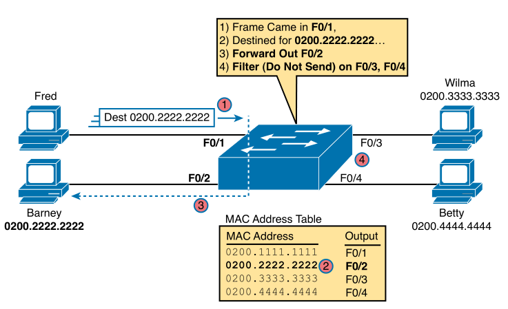
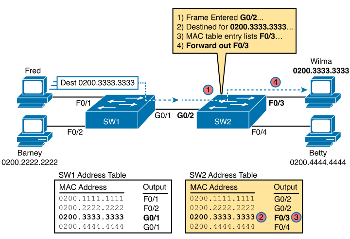
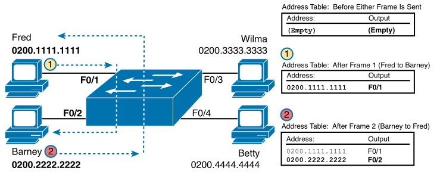
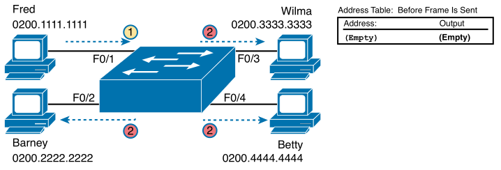
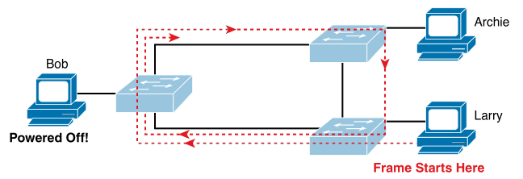

# Chapter 5

Primary features of LAN switches:
* make decisions to forward or filter frames
* learn mac addresses
* implement and maintain STP

**switches act like a host in regards to IP - needs a default gateway**

do switches flood unknown multicast frames? yes

does the default gateway need to be manually configured on a switch? yes?

does a switch send out the same unicast frame to all ports that have the same destination mac address? no

switches autonegotiate 10/100, 10/100/1000 interfaces by default.

## Terms
* **Broadcast frame**: frame sent to FFFF.FFFF.FFFF, deliver to all hosts on LAN
* **Known unicast frame**: frame's dest MAC address is listed in a switch and sent out of it's corresponding port
* **Spanning Tree Protocol**: protocol that dynamically blocks ports for traffic on switches/bridges to prevent loops
* **Unknown unicast frame**: frame not in a switch's MAC Address table, switch must flood for frame
* **MAC address table**: dynamic list of MACs on switch that listens and decides incoming frames' destination
* **Forward**: send a frame from one interface and out another
* **Flood**: forwards frames out all interfaces except receiving interface for broadcast, unknown unicast and multicast frames

## LAN Switching Concepts

**Campus-lan**: end-user devices connect to lan switches

**Data center**: servers and switches in a closed room that connect to the campus-lan

Actions performed by switches:
1. Decide when to forward or filter a frame based of destination MAC address.
2. Prepare to forward by examining the source mac address of each frame received (learning).
3. Only forward one copy of the frame to the destination by using Spanning Tree Protocol (STP) to prevent loops.

If a switch receives a known unicast frame and is meant to be sent from the same interface it was received from, then the switch ignores the frame.

<!-- <div style="text-align: center">
    
    <p>Sample switch forwarding and filtering decision</p>
</div> -->

<div style="text-align: center">
    <br>
    
    <p>Forwarding known unicast frames between two switches</p>
</div>

<div style="text-align: center">
    <br>
    
    <p>Switching learning MAC addresses from two frames sent between Fred and Barney</p>
</div>

<div style="text-align: center">
    <br>
    
    <p>Switch flooding: unknown unicast arrives, floods out other ports</p>
</div>

Switch floods all ports except for receiving port, the device with the requested MAC replies, the switch learns the device's MAC address. This applies to unknown unicast and broadcast frames.

### Spanning Tree Protocol (STP)

Without STP, flooded frames would loop infinitely in Ethernet networks with redundant links.

STP causes each port on a switch to be in blocking (can't forward) or forwarding (can forward) states, so **only one active logical path exists between any device**.

<div style="text-align: center">
    
    <p>Network with redundant links, no STP (frame loops forever both directions)</p>
</div>


## Verifying and Analysing Ethernet Switching

### Demonstrating MAC Learning

Reset config of switch:
```
erase startup-config
delete vlan.dat
reload
hostname SW1
```

`show mac address-table dynamic` lists the MAC address table of a switch.

Switches forward frames within VLANs, frame received from a port in VLAN 1 only is forwarded to ports on VLAN 1.

### Switch Interfaces

`show interfaces status` lists all ports and their connection status.

Switches name their ports based on the fasted speed supported, i.e. 10/100/1000Mbps is Gigabit Ethernet.

`show interfaces f0/1 counters`

### Finding Entries in the MAC Address Table

`show mac address-table dynamic address 0200.1111.1111`

`show mac address-table dynamic interface fastEthernet 0/1`

`show mac-address table dynamic vlan 1`

### Managing the MAC Address Table (Aging, Clearing)

Switches remove MAC table entries that have not been used for x number of seconds, default is 300 seconds.

The oldest entries in aging time are removed when the switch runs out of memory for new entries.

Aging time can be overridden by setting a specific VLAN to do so.

`show mac address-table aging-time`

`show mac address-table count`

**CAM (Content-addressable memory)**: physical memory with great table lookup capabilities, where MAC table entries are stored.

`clear mac address-table dynamic` - enable mode command, can add `vlan x`, `interface x` or `address x`