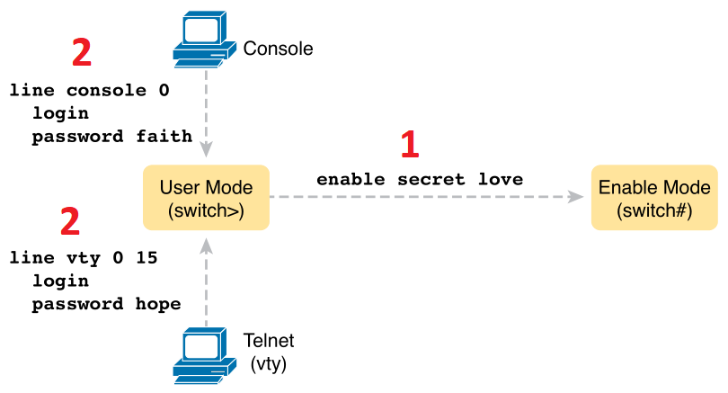
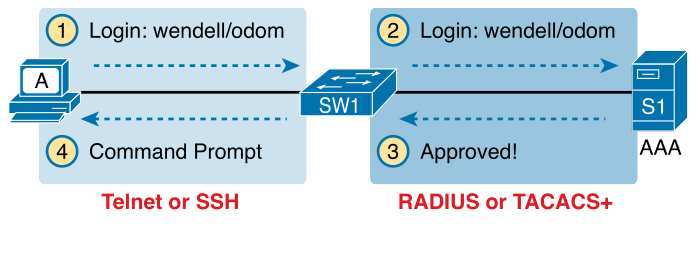
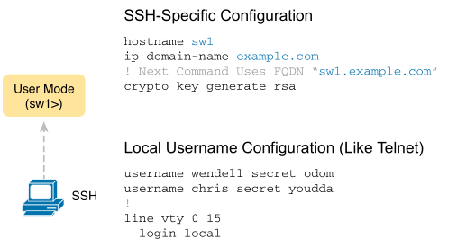
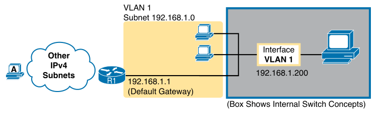

# Chapter 6

Are settings tied to each vlan?

can you *remote* into different vlans?

does only one vlan control the whole switch when remoting in?

## Terms
* **Telnet**: protocol used to remote into systems with a CLI without encryption
* **SSH**: remote into systems with a CLI using encryption and keys
* **Local username**: username (with password) configured locally on a router or switch
* **AAA**:
    * **A**uthentication - confirms **identity** of user/device
    * **A**uthorisation - what user/device is allowed to do (**permissions**)
    * **A**ccounting - records user/device access attempts (**logs**)
* **AAA server**: contains security info and provides user login services
* **Enable mode**: enable settings to switches/routers (user EXEC, password, reload)
* **Default gateway**: IP address of a router, a host sends packets to this IP when sending outside of subnet.
* **VLAN interface**: interface between IOS and VLAN supported inside switch
* **History buffer**: list of commands in IOS that a user has entered in their session
* **DNS**: protocol that translates hostnames into IP addresses and vice versa
* **Name resolution**: IP host discovers IP address associated with a hostname
* **Log message**:

Work performed by networking devices:
1. Data plane - switches forwarding frames
2. Configuration and processes - control and change choices made by data plane
3. Management plane - security, remoting into device

## Securing the Switch CLI

Switch needs to be configured an IP address to support Telnet and SSH.

### Securing User Mode and Privileged Mode with Simple Passwords

Accessing user mode - console users supply console password, Telnet users supply vty password.

Accessing enable mode - both users supply the enable password

     
    
    
Simple Password Security Configuration - set enable mode password first

`login` tells IOS t enable a password (no username) on this line.

`password` is the password used.

`enable secret` is the enable mode password.

Virtual terminal (VTY) lines are the amount of possible connections allowed to a router/switch, numbered 0-15.

### Securing User Mode Access with Local Usernames and Passwords

     
    
    
Configuring switches to use local username login authentication

`no password` can be used to remove existing shared passwords.

### Securing User Mode Access with External Authentication Servers

Switches log all commands users enter and when the log into the switch.

     
    
    
Basic authentication process with an external AAA server

RADIUS and TACACS+ are protocols that encrypt passwords.

### Securing Remote Access with Secure Shell

     
    
    
Adding SSH configuration to local username configuration

The switch creates the fully qualified domain name (FQDN) from hostname and domain name.

Key modulus is prompted if not specified as a parameter in `crypto`.

`transport input` in vty mode allows to set Telnet/SSH (`all`, `none`, `telnet`, `ssh`).

`show ip ssh` lists status information about the SSH server.

`show ssh` lists each client currently connected to the switch.

## Enabling IPv4 for Remote Access

### Host and Switch IP Settings

Switches use a VLAN interface which acts as its NIC.

     
    
    
Switches require a default gateway to be set to send frames outside a subnet

### Configuring IPv4 on a Switch

1. `interface vlan 1` - configure vlan 1
2. `ip address <ip-address> <mask>` - assign IP address and subnet mask
3. `no shutdown` - administratively enable vlan 1 interface
4. `ip default-gateway <ip-address>` - set default gateway
5. (Optional) `ip name-server <ip-address-1> <ip-address-2> ...` - set DNS severs for name resolution

### Configuring a Switch to Learn Its IP Address with DHCP

1. `interface vlan 1`
2. `ip address dhcp`
3. `no shutdown`

### Verifying IPv4 on a Switch