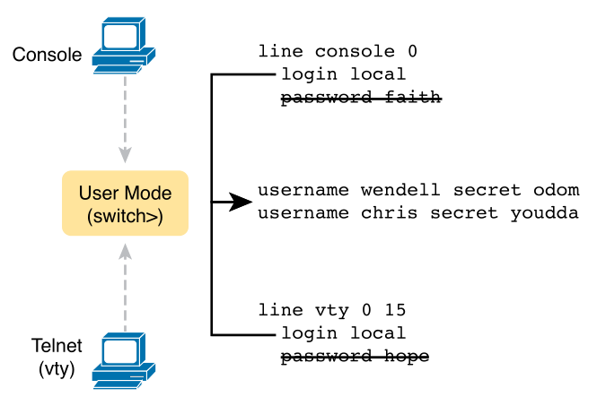

# Chapter 6

## Terms
* **Telnet**: protocol used to remote into systems with a CLI without encryption
* **SSH**: remote into systems with a CLI using encryption and keys
* **Local username**: username (with password) configured locally on a router or switch
* **AAA**: **A**uthentication (identity of user/device), **A**uthorisation (permissions), **A**ccounting (logging commands)
* **AAA server**: contains security info and provides user login services
* **Enable mode**: enable settings to switches/routers (user EXEC, password, reload)
* **Default gateway**: IP address of a router, host sends packets to this IP when sending outside subnet.
* **VLAN interface**: interface between IOS and VLAN supported inside switch
* **History buffer**: list of commands in IOS that a user has entered in their session
* **DNS**: protocol that translates hostnames into IP addresses and vice versa
* **Name resolution**: IP host discovers IP address associated with a hostname

## Setting Passwords for User/Enable Mode

### Shared Password - Console, Telnet, Enable Mode

<div style="text-align: center">
    <br>
    
    <p>Simple Password Security Configuration - set enable mode password first</p>
</div>

Virtual terminal (VTY) lines are the amount of possible connections allowed to a router/switch, numbered 0-15.

### Local Usernames/Passwords - Console, Telnet/SSH

`no password` can be used to remove existing shared passwords.

<div style="text-align: center">
    <br>
    
    <p>Configuring switches to use local username login authentication</p>
</div>

<div style="text-align: center">
    <br>
    
    <p>Adding SSH configuration to local username configuration</p>
</div>

Note: Key modulus is prompted if not specified as a parameter in `crypto`.

`transport input [all | none | telnet | ssh]` in vty mode allows to set Telnet/SSH.

`show ip ssh` lists status information (SSH version) about the SSH server.

`show ssh` lists each client currently connected to the switch through SSH.

### External Authentication Servers

Switches log all commands users enter and when the log into the switch.

<div style="text-align: center">
    <br>
    
    <p>Basic authentication process with an external AAA server</p>
</div>

RADIUS and TACACS+ are protocols that encrypt passwords.

## IPv4 Remote Access on Switches

### Host and Switch IP Settings

Any VLAN can be used as a management VLAN, needs an IP address and default gateway configured.

Switches use a VLAN interface which acts as its NIC.

<div style="text-align: center">
    <br>
    
    <p>Switches require a default gateway to be set to send frames outside a subnet</p>
</div>

### Configuring IPv4

```
interface vlan <x>
ip address <ip-address> <mask>
no shutdown
ip default-gateway <ip-address>
ip name-server <dns-ip-1> <dns-ip-2> ...
```

### Enable DHCP

```
interface vlan <x>
ip address dhcp
no shutdown
```

### Check IP Address and Subnet Mask

* `show running-config`
* `show interfaces vlan <x>`
* `show dhcp lease`

## Other Commands

* `show history` - EXEC command to list commands entered held in the history buffer
* `terminal history size <x>` - Change history buffer size in EXEC mode for logged in user only for this session
* `history size <x>` - config command that sets the history buffer size by default for all users
* `no logging console` - global config command to disable log messages on a switch
* `logging synchronous` - global config command to display syslog messages after output of commands
* `exec-timeout <minutes> <seconds>` - set inactivity timer, default is 5 minutes
* `no ip domain-lookup` - stops the switch from resolving hostnames, prevents waiting after mistyped commands