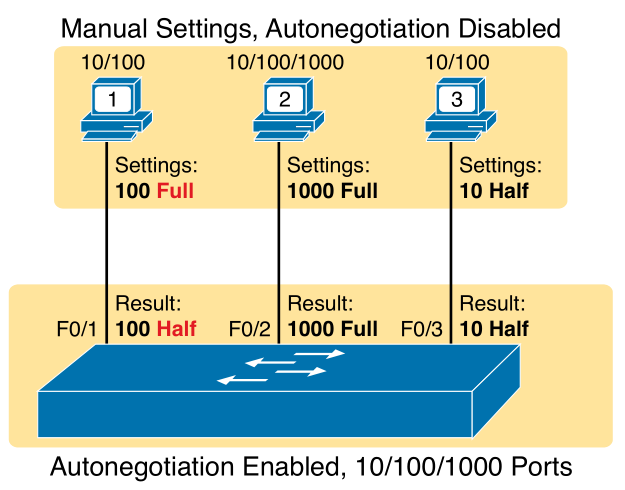

# Chapter 7

## Terms

* **Autonegotiation**: two nodes agreeing on same Ethernet standards (aka IEEE 802.3u)
* **Full duplex**: send and receive data at the same time.
* **half duplex**: send or receive data at a given time, requires CSMA/CD.
* **10/100**: Ethernet NIC tha supports 10/100Mbs.
* **10/100/1000**: Ethernet NIC that supports 10/100/1000Mbps.

## Basic Interface Configuration

`duplex {auto | full | half}`

`speed {auto | 10 | 100 | 1000}`

`description <text>`

`show interfaces status` - list all interfaces, show status, vlan, duplex, speed and type

`interface range FastEthernet 0/11 - 20` - configure Fa0/11 to Fa0/20

`shutdown` disables ports (administratively down), `no shutdown` enables ports.

`no <command>` on commands speed, duplex, description, configures to their default setting.

## Autonegotiation

Autonegotiation is enabled by default, manually configuring duplex/speed disables autonegotiation.

`a-full` is full duplex, `a-100` is 100Mbps both autonegotiated on a connected port.

Hubs do not forward or react to autonegotiation messages and use IEEE rules (10Mbps, half duplex, CSMA/CD required).

### On Both Ends

Devices on both ends of a link must use the same standard, 100BASE-T cannot communicate with 1000BASE-T.

Autonegotiation opts for the highest speed and duplex supported between devices on ends of a link.

### Only On One End

Sometimes autonegotiation is disabled on links to configure desired speed and duplex settings.

Autonegotiation enabled on one side and speed/duplex is set on the other, the link may work poorly.

Duplex mismatch: two nodes have different duplex modes configured, will be still listed as up/up.

If no response is received to autonegotiate, switches set (IEEE rules):
* Speed - sense the speed (cisco switch feature), otherwise use slowest speed (usually 10Mpbs)
* Duplex - if speed is 10Mbps or 100Mpbs use half duplex otherwise use full duplex.

     
    
    
IEEE autonegotiation results with autonegotiation disabled on one side

## Interface Status Codes

| Line Status (L1) | Protocol Status (L2) | Interface Status | Typical Root Cause |
| :-: | :-: | :-: | :-: |
| administratively down | down | disabled | `shutdown` is configured on the interface. |
| down | down | notconnect | No/bad/wrong cable, speed mismatch, connected  device is either powered off, shutdown or error disabled. |
| up | down | notconnect | Not expected on LAN switch physical interfaces. |
| down | down (err-disabled) | err-disabled | Port security has disabled the interface. |
| up | up | connected | The interface is working. |

## Common L1 Problems

Interface counters from `show interfaces <x>`:
* **Runts** - frame smaller than minimum size ( < 64 bytes)
* **Giants** - frames bigger than maximum size ( > 1518 bytes)
* **Input Errors** - total (runts, giants, no buffer, CRC, frame, overrun, ignored counts)
* **CRC** - frames not passing FCS math
* **Frame** - frame has incorrect format
* **Packet Output** - total packets sent out of interface
* **Output Errors** - total packets failed after trying to transmit
* **Collisions** - count of collisions caused when transmitting from this interface
* **Late Collisions** - collisions that occurred after a frame's 64th byte (possible duplex mismatch)