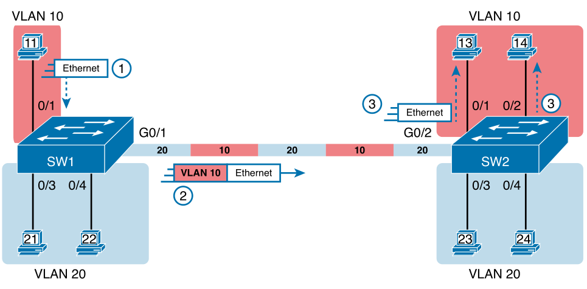
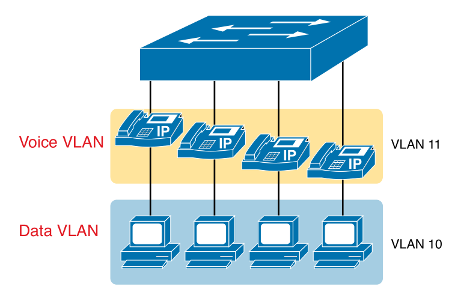

# Chapter 8

## Terms

* **802.1q**: protocol for VLAN trunking and RSTP.
* **Trunk**: VLAN headers are added to segments which identify the VLAN it belongs to
* **VLAN**: devices grouped into a single broadcast domain across switches in a LAN
* **VTP**: protocol that communicates information about VLANs (ID and name)
* **Access Interface**: switch interface connected to end user device, does not use trunking
* **Trunk Interface**: switch interface configured so that it uses VLAN trunking
* **Native VLAN**: the one VLAN ID on a VLAN trunk forwarded without 802.1q header
* **Default VLAN**: generally VLAN 1, ports assigned this VLAN act as an access port
* **Static Access Interface**: manually assigning VLANs through static configuration

## VLAN Concepts

* **A LAN includes all devices in the same broadcast domain**
* Reasons to create smaller broadcast domains:
    * less broadcast frames
    * less hosts are flooded
    * security can be specified by VLANs
    * groups users/devices
    * less devices to troubleshoot
    * reduces STP workload
* VLAN tagging - switch adds header (802.1q) to frame before sending over VLAN trunk (vlan id)
* **802.1q**: 4 byte header, VLAN ID is 12 bits, supports values 1 to 4094. 1 to 1005 are normal-range, 1006-4094 are extended-range.

### VLAN Trunks

<div style="text-align: center">
    
    <p>VLAN trunking between two switches - 4 subnets, 2 VLANs</p>
</div>

## VLAN and VLAN Trunking Configuration

```
! Creating VLANs and assigning access VLANs to an interface

vlan <vlan-id>                      ! select vlan to config
name <name>                         ! becomes VLANZZZZ if no name is specified
interface <type> <number>           ! can use range of ports
switchport access vlan <id-number>  ! specify vlan
switchport mode access              ! optional - set port to access mode, not to trunk
```

`show vlan brief` - list all vlans with status and ports

`show vlan id <id-number>` - outputs that vlan's status, ports, type, SAID, MTU, etc.

### VLAN Trunking Protocol

* VTP advertises all vlans in a switch to all other switches, use `vtp mode transparent` to disable it.

### VLAN Trunking Configuration

| Command Option<br>`switchport mode <x>` | Description |
| --- | --- |
| `access` | Act as access (non-trunk) port |
| `trunk` | Act as trunk port |
| `dynamic desirable` | Initiate negotiate to use trunking |
| `dynamic auto` | Wait for switch to negotiate to use trunking |

`show interfaces trunk` - lists all interfaces operating as VLAN trunks

`show interfaces <interface> <number> switchport` - list info about a port (like trunk/access info)

| Administrative Mode | Access | Dynamic Auto | Trunk | Dynamic Desirable |
| --- | --- | --- | --- | --- |
| `access` | Access | Access | Do Not Use | Access |
| `dynamic auto` | Access | Access | Trunk | Trunk |
| `trunk` | Do Not Use | Trunk | Trunk | Trunk |
| `dynamic desirable` | Access | Trunk | Trunk | Trunk |

#### Data/Voice VLAN

<div style="text-align: center">
    
    <p>A LAN design with data in VLAN 10 and Phones in VLAN 11</p>
</div>

```
! To set up data and voice VLANs

vlan <vlan-id>                      ! create data/voice VLANs if they don't exist
interface <type> <number>           
switchport access vlan <id-number>  
switchport mode access              
switchport voice vlan <id-number>   ! set voice VLAN ID
```

## Troubleshooting VLANs and VLAN Trunks

`[no] shutdown vlan <number>` to enable/disable VLAN

Two connected switches could recognise two different native VLANs (native VLAN omits 802.1q header), `switchport trunk native vlan <vlan-id>` sets native VLAN for trunk.

`switchport mode dynamic auto` on two connected switches results in both waiting to negotiate trunking, it never trunks so it comes up as 'static access' in `show interfaces switchport`.

<div style="text-align: center">
    
    <p>Mismatched trunking operational states</p>
</div>

### The Supported VLAN List on Trunks

`switchport trunk allowed vlan <start>-<end>` - used to limit trunk support for certain VLANs

`show interfaces trunk` lists:
1. VLANs allowed - 1 to 4094
2. VLANs allowed and active - above and VLANs not defined locally/shutdown
3. VLANs in ST - above and VLANs not in STP blocking state or VTP pruned