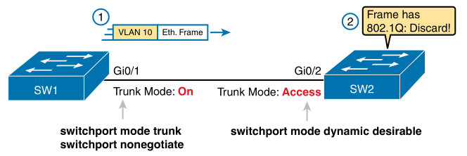

# Chapter 8

## Terms

* **802.1Q**: 
* **Trunk**: 
* **Trunking Administrative Mode**: 
* **Trunking Operational Mode**: 
* **VLAN**: 
* **VTP**: 
* **VTP Transparent Mode**: 
* **Layer 3 Switch**: 
* **Access Interface**: 
* **Trunk Interface**: 
* **Data VLAN**: 
* **Voice VLAN**: 
* **Native VLAN**: 
* **Default VLAN**: 
* **Static Access Interface**: 

## VLAN Concepts

* **A LAN includes all devices in the same broadcast domain**

<div style="text-align: center">
    
    <p>Creating two broadcast domains using one switch and vlans</p>
</div>

* Reasons to create smaller broadcast domains:
    * reduce CPU usage - less broadcast frames
    * improves security - less hosts flooded
    * specify security for different vlans
    * groups users/devices
    * easier to troubleshoot with less devices
    * reduce STP workload
* VLAN tagging - switch adds header (802.1q) to frame before sending over VLAN trunk (vlan id)

### Creating Multiswitch VLANs Using Trunking

#### VLAN Tagging Concepts

* VLAN trunking combines all vlans through one link

<div style="text-align: center">
    
    <p>VLAN trunking between two switches</p>
</div>

#### 802.1Q and ISL VLAN Trunking Protocols

* 4 byte header is added to frame, VLAN ID is 12 bits, supports values 1 to 4094
* VLAN IDs 1 to 1005 are normal-range, 1006 to 4094 are extended-range
* VLAN 1 is default VLAN aka native VLAN, no header is added to frames for this VLAN

### Forwarding Data Between VLANs

#### The Need for Routing Between VLANs

#### Routing Packets Between VLANs with a Router

* Devices in different VLANs need to be in different subnets
* Only L3 switches and routers can connect different VLANs/subnets together

## VLAN and VLAN Trunking Configuration and Verification

### Creating VLANs and Assigning Access VLANs to an Interface

```
vlan <vlan-id>
name <name>                         ! becomes VLANZZZZ if no name is specified
interface <type> <number>           ! can use range of ports
switchport access vlan <id-number>
switchport mode access              ! optional - set port to access mode, not to trunk
```

#### VLAN Configuration Example 1: Full VLAN Configuration

`show vlan brief` - list all vlans with status and ports

`show vlan id <id-number>` - outputs that vlan's status, ports, type, SAID, MTU, etc.

#### VLAN Configuration Example 2: Shorter VLAN Configuration

### VLAN Trunking Protocol

* VTP advertises all vlans in one switch to all other switches.
* Most organisations disable it, use `vtp mode transparent` to disable it.

### VLAN Trunking Configuration

Setting `switchport mode trunk` on two connected switches forces a VLAN trunk between them.

| Command Option | Description |
| --- | --- |
| `access` | Act as access (non-trunk) port |
| `trunk` | Act as trunk port |
| `dynamic desirable` | Initiate negotiate to use trunking |
| `dynamic auto` | Wait for switch to negotiate to use trunking |

`show interfaces trunk` - lists all interfaces operating as VLAN trunks

`show interfaces <interface> <number> switchport` - list info about a port (like trunk/access info)

| Administrative Mode | Access | Dynamic Auto | Trunk | Dynamic Desirable |
| --- | --- | --- | --- | --- |
| `access` | Access | Access | Do Not Use | Access |
| `dynamic auto` | Access | Access | Trunk | Trunk |
| `trunk` | Do Not Use | Trunk | Trunk | Trunk |
| `dynamic desirable` | Access | Trunk | Trunk | Trunk |

It's best practice to disable trunk negotiation on most ports for better security as DTP will be disabled on access ports.

### Implementing Interfaces Connected to Phones

#### Data and Voice VLAN Concepts

* It's best practice to put phones in a VLAN and PCs in another.
* IP telephones have small LAN switches, one cable to connect to phone then patch cable from phone to PC, use two VLANs (both are trunk-ed):
    * **Data VLAN** - PC traffic
    * **Voice VLAN** - phone's traffic

<div style="text-align: center">
    
    <p>A LAN design with data in VLAN 10 and Phones in VLAN 11</p>
</div>

#### Data and Voice VLAN Configuration and Verification

```
vlan <vlan-id>                      ! create data/voice VLANs if they don't exist
interface <type> <number>           ! config data VLAN 1
switchport access vlan <id-number>  ! config data VLAN 2
switchport mode access              ! config data VLAN 3
switchport voice vlan <id-number>   ! set voice VLAN ID
```

#### Summary: IP Telephony Ports on Switches

## Troubleshooting VLANs and VLAN Trunks

### Access VLANs Undefined or Disabled

`[no] shutdown vlan <number>` to enable/disable VLAN

### Mismatched Trunking Operational States

`switchport mode dynamic auto` on two connected switches results in both waiting to negotiate trunking, it never trunks so it comes up as 'static access' in `show interfaces switchport`.

<div style="text-align: center">
    
    <p>Mismatched trunking operational states</p>
</div>

### The Supported VLAN List on Trunks

`switchport trunk allowed vlan <start>-<end>` - used to limit trunk support for certain VLANs

`show interfaces trunk` lists:

| List<br>Position | Heading | Reasons |
| --- | --- | --- |
| First | VLANs allowed | VLANs 1-4094 |
| Second | VLANs allowed and active | First list minus VLANs not defined locally and shutdown |
| Third | VLANs in ST | Second list minus VLANs in STP blocking state and VTP pruned |

### Mismatched Native VLAN on a Trunk

Two connected switches could recognise two different native VLANs (native VLAN omits 802.1Q header), `switchport trunk native vlan <vlan-id>` sets native VLAN for trunk.