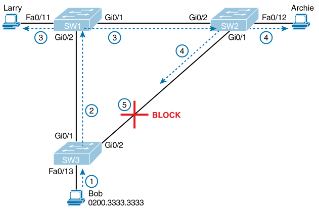
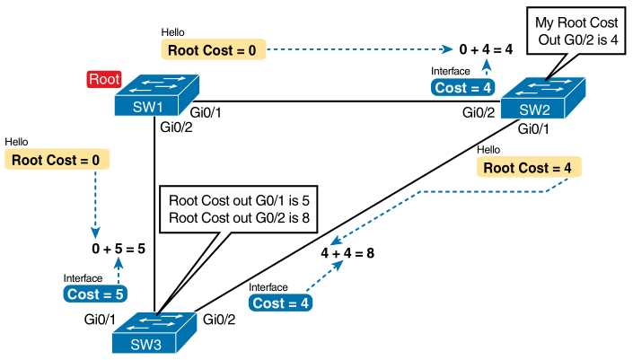

# Chapter 9

## Terms

* **blocking state**: 
* **BPDU guard**: 
* **bridge ID**: 
* **bridge protocol data unit (BPDU)**: 
* **designated port**: 
* **EtherChannel**: 
* **forward delay**: 
* **forwarding state**: 
* **Hello BPDU**: 
* **learning state**: 
* **listening state**: 
* **MaxAge**: 
* **PortFast**: 
* **root port**: 
* **root switch**: 
* **root cost**: 
* **Spanning Tree Protocol (STP)**: 
* **Rapid STP (RSTP)**: 
* **alternate port**: 
* **backup port**: 
* **disabled port**: 
* **discarding state**: 

## STP and RSTP Basics

* STP/RSTP prevents looping frames by adding an additional check on each interface before a switch uses it to send or receive user traffic.
    * Forwarding mode: use port in a VLAN as usual
    * Block mode: block all sending/receiving on the port
* Broadcast storm - any Ethernet frame loops around a LAN indefinitely, saturating the LAN with copies of itself

### The Need for Spanning Tree

### What Spanning Tree Does

* Problems caused if STP/RSTP is not used:
    1. Broadcast storms - frame forwarded repeatedly on same links
    2. MAC table instability - table is continuously updated with incorrect entries
    3. Multiple frame transmission - host receives multiple copies of a frame

    
    
STP/RSTP blocking a port to stop networking loops

### How Spanning Tree Works

* Putting interfaces in forwarding state:
    * Root port is selected
    * Ports on each switch have a root cost, lowest root cost is the root port
    * Switch and switch port with the lowest root cost is the designated switch/port
* Reasons for forwarding/blocking:
| Characterisation of Port | STP State | Description |
| --- | --- | --- |
| All the root switch's ports | Forwarding | Root switch is designated switch |
| Each nonroot switch's root port | Forwarding | Lowest root cost port to root switch |
| Each LAN's designated port | Forwarding | Switch forwarding the Hello with lowest root cost is designated switch |
| All other working ports | Blocking | Port cannot forward/receive user frames |

#### The STP Bridge ID and Hello BPDU

* Hello BPDU (bridge protocol data unit) is used to exchange info with other switches and has fields:
    * Root bridge ID 
    * Sender's bridge ID 
    * Sender's root cost 
    * Timer values on root switch - Hello, MaxAge, forward delay timers

#### Electing the Root Switch

* Root selection:
    1. Lowest priority BID
    2. If that ties then lowest switch MAC address

#### Choosing Each Switch's Root Port

    
    
Calculating total cost from SW3 to the root - smallest one is used

* If a tie occurs then choose the lowest neighbour's: BID -> port priority -> port number

#### Choosing the Designated Port on Each LAN Segment

* Only SW3's Gi0/2 port is blocked, all other interfaces are forwarding
* Switch ports connected to endpoints are designated ports

### Configuring to Influence the STP Topology

* The priority can be changed per switch to influence the choices of STP/RSTP
* Port cost can be changed per port, per VLAN

| Ethernet Speed | IEEE Cost: 1998 & Before | IEEE Cost: 2004 & After |
| --- | --- | --- |
| 10 Mbps | 100 | 2,000,000 |
| 100 Mbps | 19 | 200,000 |
| 1 Gbps | 4 | 20,000 |
| 10 Gbps | 2 | 2,000 |
| 100 Gbps | N/A | 200 |
| 1 Tbps | N/A | 20 |

* Cost defaults is based on operating speed of link (**10**/100/1000 -> 100 cost)
* Use `spanning-tree pathcost method long` to use the right side of the table

## Details Specific to STP (not RSTP)

### STP Activity When the Network Remains Stable

1. Root switch sends a new Hello BDPU (root cost 0) out working interfaces every 2 seconds (by default)
2. Nonroot switch receives, adds it's BID as sender's BID and switch's root cost, forwards Hello out all designated ports
3. Repeat 1 & 2 until something changes

### STP Timers That Manage STP Convergence

| Timer | Default Value | Description |
| --- | --- | --- |
| Hello | 2 seconds | Hellos created by root |
| MaxAge | 10 times Hello | Wait time after not hearing Hellos |
| Forward delay | 15 seconds | ... |

### Changing Interface States with STP

## RSTP Concepts

### Comparing STP and RSTP

### RSTP and the Alternate (Root) Port

### RSTP States and Processes

### RSTP and the Backup (Designated)

### RSTP Port Types

### Optional STP Features